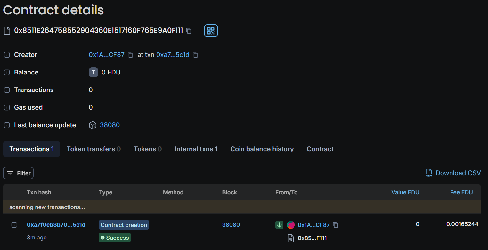

# studentIdentity

studentIdentity is a smart contract-based application for managing student records on the Ethereum blockchain. This decentralized application allows for the secure storage and retrieval of student details such as name, roll number, mobile 

 

## Vision

studentIdentity aims to revolutionize the way educational institutions handle student records by leveraging blockchain technology. Our vision is to provide a transparent, immutable, and easily accessible record-keeping system that enhances the reliability of student data management.

## Project Features

- **Add New Student**: Allows users to add new student records with validation to ensure accuracy.
- **Update Student Details**: Provides functionality to update existing student records.
- **Retrieve Student Details**: Enables retrieval of student details based on roll number.
- **Validation**: Includes comprehensive validation for fields such as mobile number, CGPA, LinkedIn, and GitHub URLs.
- **Event Emission**: Emits events whenever a student record is added or updated to facilitate tracking and monitoring.
- **CGPA Parsing and Validation**: Parses and validates CGPA to ensure it falls within the valid range (0.0 to 10.0).
- **URL Validation**: Validates LinkedIn and GitHub URLs to ensure they are in the correct format.

## Future Scope

- **Integration with Front-End**: Develop a user-friendly front-end interface for easier interaction with the contract.
- **Enhanced Validation**: Add more sophisticated validation rules and checks.
- **Advanced Features**: Introduce additional features such as student performance analytics and integration with other educational platforms.
- **Scalability Improvements**: Optimize contract for better scalability and lower gas costs.
- **Security Audits**: Perform thorough security audits to identify and address potential vulnerabilities.

## Project Structure

```
/studentIdentity
│
├── contracts
│   └── student.sol        # Main smart contract file
│
├── README.md               # Project overview and documentation
└── package.json            # Node.js dependencies (if applicable)
```

## Developer Details

- **Name**: Bhavya Sunkari
- **GitHub**: https://github.com/Bhavya445
- **Email**: bhavya4405@gmail.com
- **LinkedIn**: https://www.linkedin.com/in/bhavya-sunkari-81b601288/

## Deployment
Chain Name: Educhain Open Campus

Contract Id: 0x8511e264758552904360e1517f60f765e9a0f111

